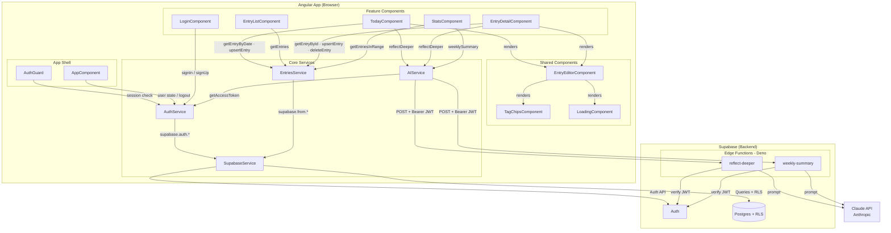
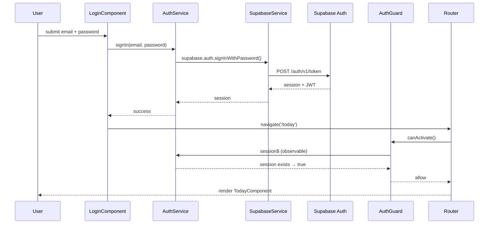
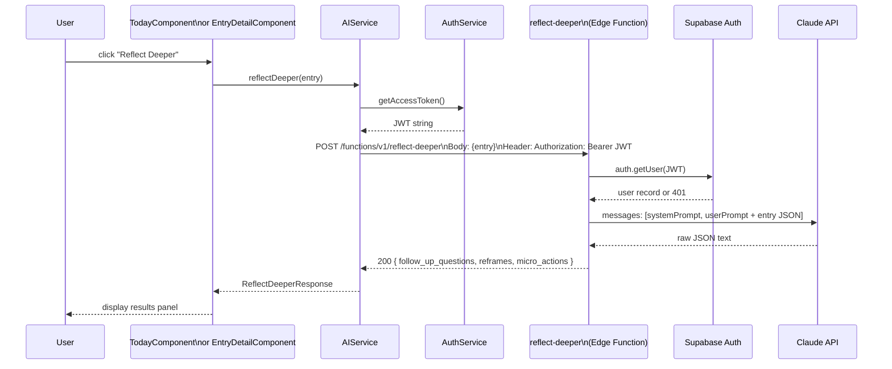

# Dependency Diagram

## 1. Full System Overview

Shows how every component, service, and external system relates to each other.

---

## 2. Auth Flow (Sequence)

What happens when a user signs in and navigates to a protected route.

---

## 3. AI Feature Flow (Sequence)

What happens when a user clicks "Reflect Deeper" (same pattern for "Weekly Summary").

---

## 4. Service Responsibility Summary

| Service | Owns | Talks to |
|---|---|---|
| `SupabaseService` | Supabase JS client singleton | Supabase Auth + Postgres |
| `AuthService` | Session state, `session$`, `user$` observables | `SupabaseService` |
| `EntriesService` | All CRUD + query methods for entries | `SupabaseService` |
| `AIService` | Edge function HTTP calls | `AuthService` (JWT), Edge Functions |
| `AuthGuard` | Route protection | `AuthService` |

## 5. Data Ownership Rules

- **Components** never call Supabase directly — always go through a service.
- **AIService** never calls Claude directly — always goes through an Edge Function.
- **Edge Functions** are the only layer that holds `ANTHROPIC_API_KEY`.
- **RLS policies** enforce that every Postgres query is scoped to `auth.uid() = user_id`.
